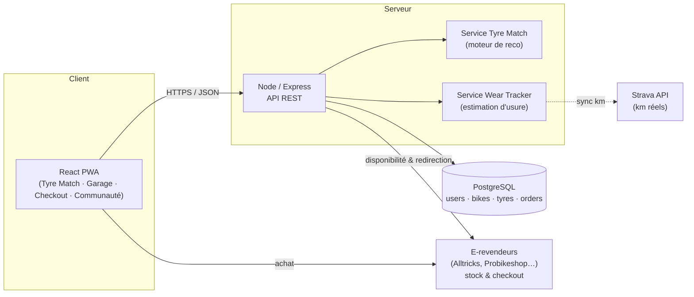
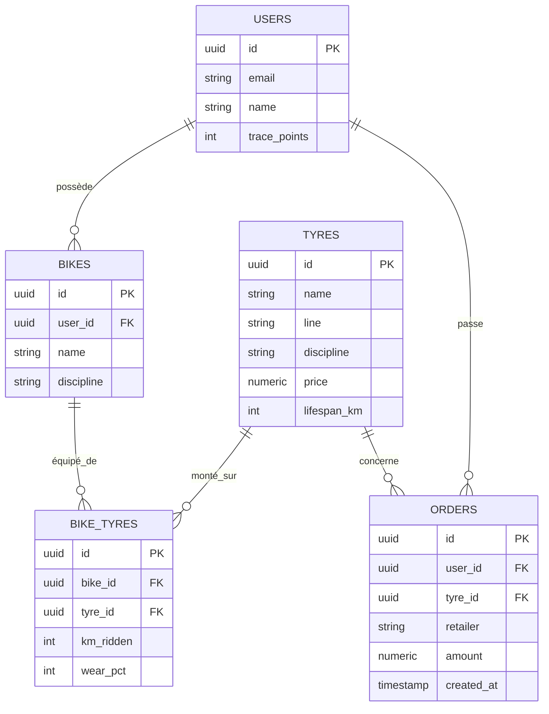
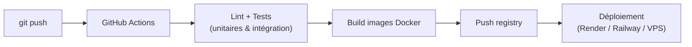

# Architecture technique — TRACE by Michelin

> Stack : **React** (frontend) · **Node.js / Express** (API) · **PostgreSQL** (données)
> Conteneurisé avec **Docker**, déploiement continu via **GitHub Actions**.

---

## 1. Vue d'ensemble

TRACE est une **Progressive Web App** (React) qui consomme une **API REST** (Node/Express).
La logique métier qui crée la valeur — le moteur **Tyre Match** et le **Wear Tracker** — vit côté
backend, ce qui la rend réutilisable (web, mobile, partenaires).

## 2. Justification de la stack

| Couche | Choix | Pourquoi |
|---|---|---|
| Frontend | **React** (Vite + PWA) | Composants réutilisables, écosystème mûr, installable comme une app native sans store. |
| API | **Node.js / Express** | Même langage que le front (vélocité d'équipe en hackathon), idéal pour une API REST légère et des intégrations e‑retail. |
| Base de données | **PostgreSQL** | Relationnel solide pour modéliser users ↔ vélos ↔ pneus ↔ commandes ; requêtes fiables pour le suivi d'usure. |
| Conteneurisation | **Docker / Compose** | Environnement identique pour tous, déploiement reproductible. |
| CI/CD | **GitHub Actions** | Tests + build + déploiement automatiques à chaque push. |

## 3. Modèle de données

## 4. Le cœur métier : deux services

### 4.1 Tyre Match — créer la demande
Prend le profil du cycliste (discipline, terrain, priorité) et renvoie la gomme Michelin la plus
adaptée + un score de compatibilité + les raisons. C'est ce qui transforme un catalogue en conseil.

### 4.2 Wear Tracker — générer la vente
Calcule l'usure : `wear_pct = round(km_ridden / lifespan_km * 100)`.
Quand `wear_pct >= 80`, l'API émet une **alerte de réassort** qui déclenche le parcours d'achat.
C'est le moteur de ventes court terme — la fonctionnalité notée n°1 par Michelin.

## 5. Principaux endpoints de l'API

| Méthode | Route | Rôle |
|---|---|---|
| `POST` | `/api/match` | Retourne la recommandation Tyre Match. |
| `GET` | `/api/garage/:userId` | Vélos + pneus + usure de l'utilisateur. |
| `GET` | `/api/garage/:userId/alerts` | Pneus à réassortir (wear ≥ 80%). |
| `GET` | `/api/tyres` | Catalogue de la gamme vélo Michelin. |
| `GET` | `/api/retailers/:tyreId` | Disponibilité temps réel chez les e‑revendeurs. |
| `POST` | `/api/orders` | Enregistre l'achat et réinitialise l'usure. |

## 6. Parcours de déploiement (CI/CD)

Chaque `push` sur `main` lance : lint → tests → build des images → déploiement. Le détail est dans
`.github/workflows/ci-cd.yml`.

## 7. Sécurité & scalabilité (niveau attendu 5A)

- **Auth** : JWT (stateless), mots de passe hashés (bcrypt).
- **Variables sensibles** : jamais commitées (`.env.example` fourni, `.env` ignoré).
- **Scalabilité** : API stateless → réplicable horizontalement derrière un load balancer ; Postgres
  avec connection pooling ; front servi en statique via CDN.
- **Internationalisation** : la logique métier est paramétrée par pays → duplication rapide marché par marché.
